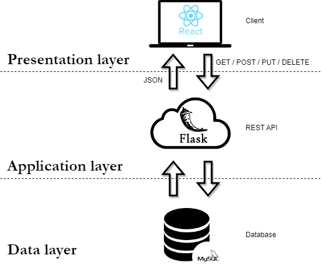

# Room Reservation System

This is a simple room reservation system. It is a web application that allows users to reserve rooms in a building. 

The application is written in Python using a Three-Tier B/S architecture. The front-end uses the React framework. The back-end is written in Python using the Flask framework. The database is a MySQL database.



## Submodules

- [Room Reservation System API](https://github.com/oezeb/rrs-api)
- [Room Reservation System UI](https://github.com/oezeb/rrs-ui)

## Deployment

Before deploying the React application must be built and the static files located in the `rrs-ui/build` directory.

### Docker

The application is configured to be deployed using Docker Compose. 

```bash
$ docker compose up -d
```